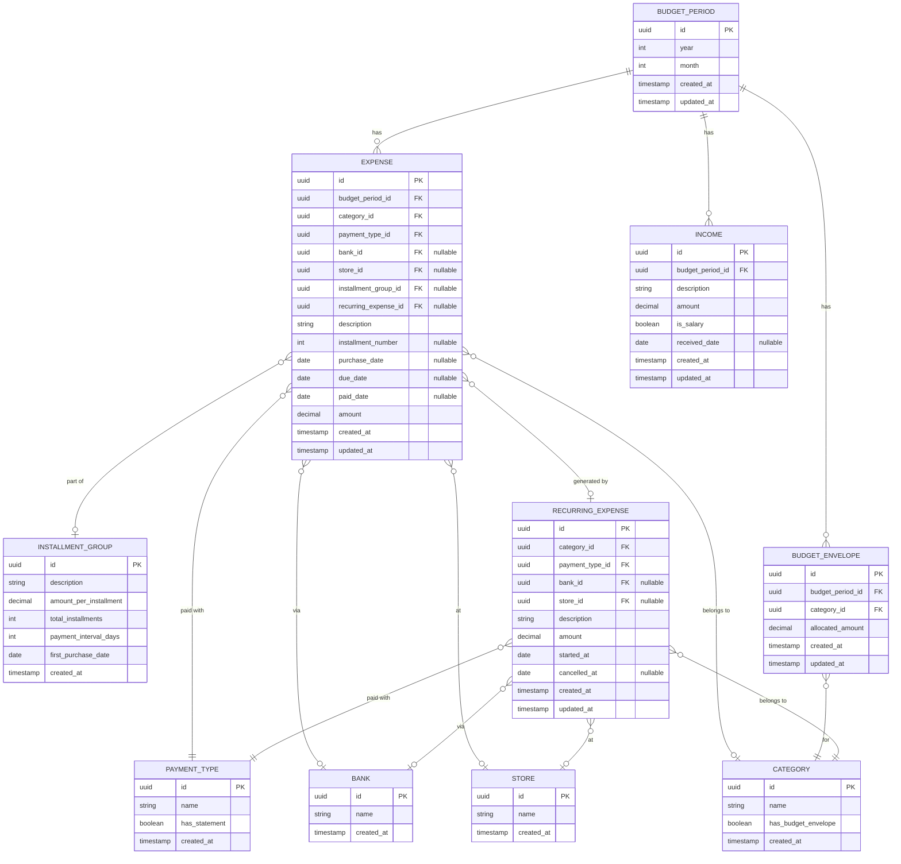

# Budget Manager Server — Database Schema

## Entity Relationship Diagram

---

## Entity Descriptions

### `BUDGET_PERIOD`
Represents a calendar month (e.g., March 2026). All expenses and incomes for a given month are scoped to one period.

### `EXPENSE`
A single expense entry. Can be a one-time purchase, one installment in a series, or one occurrence of a recurring expense.
- `bank_id` is nullable — cash payments have no bank.
- `store_id` is nullable — not all expenses are store purchases.
- `installment_group_id` links all installments of the same purchase together.
- `recurring_expense_id` links a generated row back to its recurring template.
- `installment_number` is `null` for non-installment expenses.
- `purchase_date` is nullable for system-generated rows (installments beyond the first, recurring occurrences).

### `RECURRING_EXPENSE`
A template for an expense that repeats every month indefinitely until cancelled (e.g., Netflix, gym membership, rent).
- `started_at` = the month it first appears.
- `cancelled_at` = when set, stops generating new rows in future periods. Past rows are untouched.
- When a new `BUDGET_PERIOD` is opened, the system generates one `EXPENSE` row per active `RECURRING_EXPENSE` (where `cancelled_at` is null or after the period's month).

### `INSTALLMENT_GROUP`
Created once when the user registers an installment purchase. The system auto-generates one `EXPENSE` row per installment, each assigned to the correct future `BUDGET_PERIOD`.
- `amount_per_installment` is the fixed payment per installment.
- `total_installments` drives how many `EXPENSE` rows are auto-generated.
- `payment_interval_days` defines the cadence (e.g., `30` for monthly, `14` for bi-weekly car loans). Due dates for each generated row are calculated as `first_purchase_date + (installment_number - 1) × payment_interval_days`.

### `INCOME`
A single income entry for a budget period. `is_salary = true` flags incomes that form the salary base for **% of salary** calculations. Multiple salary incomes per period are supported (e.g., two payroll deposits received on different days in the month).

> **Note:** `% of salary` is a computed value: `expense.amount / SUM(income.amount WHERE is_salary = true)`. It is not stored on the expense — it is derived at query time.

### `BUDGET_ENVELOPE`
Represents your planned spending cap for a category within a budget period.
- `allocated_amount` = what you plan to spend (e.g., $200 for Groceries in March).
- **Actual spend** = fetched from an **external REST API** that tracks real-time category balances (e.g., `GET /balances?category=Groceries&month=2026-03` → `{ spent: 50.00 }`). Not stored locally.
- **Remaining** = `allocated_amount - actual_spend` — displayed in the UI using the live API value.
- **Auto-allocation**: when opening a new period, the system suggests `allocated_amount` per envelope category as the average of the last 3 months' API-reported actual spend.

### `CATEGORY`
Lookup table for expense categories (e.g., Groceries, Entertainment, Transportation).
- `has_budget_envelope = true` marks categories that participate in envelope budgeting (and for which the external API is queried). Categories without envelopes are tracked by expense amount only.

### `PAYMENT_TYPE`
Lookup table for payment methods (e.g., Credit Card, Debit Card, Cash, Pre-authorized).
- `has_statement = true` means the expense must be linked to a `BANK`.

### `BANK`
Lookup table for financial institutions (e.g., CIBC, Neo).

### `STORE`
Lookup table for vendors/merchants (e.g., Amazon, Apple, Loblaws).

---

## Opening a New Budget Period

When the user opens a new month (e.g., April 2026), the system runs in order:

1. **Generate installment rows** — Find all `INSTALLMENT_GROUP` records with future installments due in this month (based on `payment_interval_days`) and create the corresponding `EXPENSE` rows.
2. **Generate recurring rows** — Find all `RECURRING_EXPENSE` records where `cancelled_at` is null or after April 2026 and create one `EXPENSE` row each.
3. **Suggest budget envelopes** — For each `CATEGORY` where `has_budget_envelope = true`, query the external API for the last 3 months' actual spend, compute the average, and pre-fill `BUDGET_ENVELOPE.allocated_amount`. User can adjust before confirming.
4. **Open the period** — Period becomes active and ready for manual expense entry.

---

## Key Design Decisions

| Decision | Rationale |
|---|---|
| `has_budget_envelope` on `CATEGORY` | Cleanly separates envelope-tracked categories from regular ones; drives which categories are queried from the external API |
| External API as actual spend source | Avoids double-entry for envelope categories; the remote system is the source of truth for daily grocery-level spending |
| `RECURRING_EXPENSE` as template | Cancelled date stops future generation while preserving historical rows; cleaner than a flag on each row |
| `recurring_expense_id` on `EXPENSE` | Allows tracing any generated row back to its template for editing or cancellation |
| No `partial` column on `EXPENSE` | Replaced by `BUDGET_ENVELOPE` + external API: allocated vs. actual spend is now a first-class concept |
| No `salary` field on `BUDGET_PERIOD` | Salary is one or more `INCOME` rows with `is_salary = true`; supports multiple payroll deposits per month |
| `payment_interval_days` on `INSTALLMENT_GROUP` | Supports any cadence (monthly, bi-weekly, etc.); due dates are calculated, not hardcoded |
| `% of salary` is computed | `expense.amount / SUM(incomes WHERE is_salary)` — derived at query time, always accurate |
